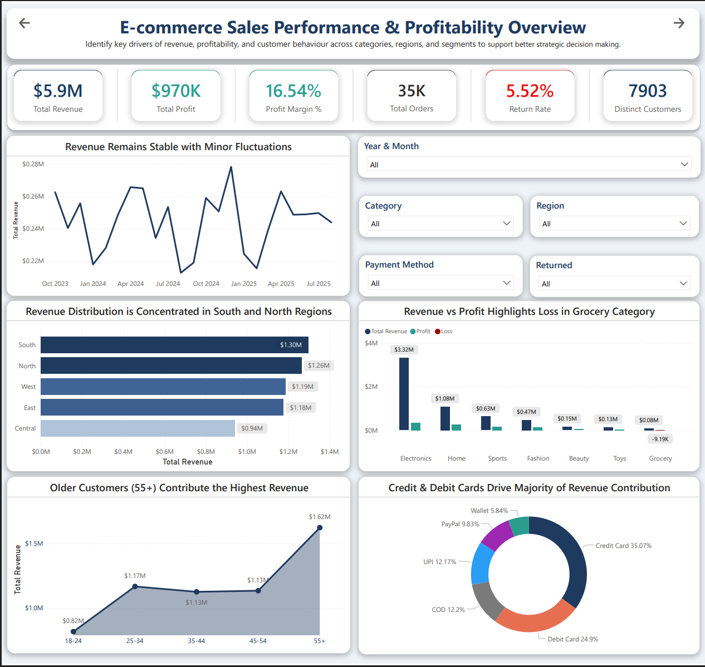
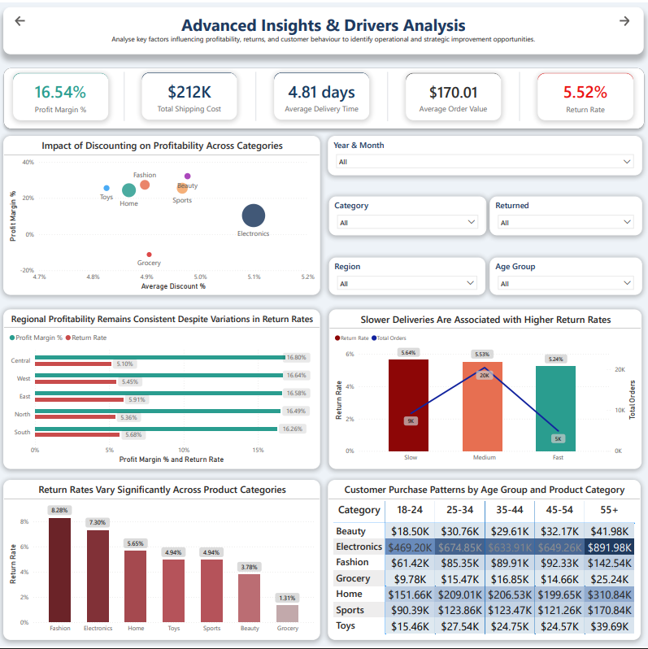
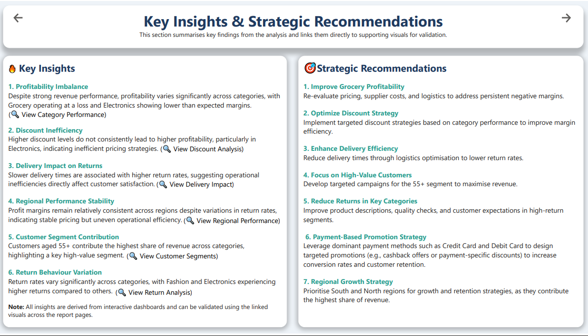

# E-commerce Sales Performance & Profitability Dashboard

An interactive Power BI dashboard developed to analyse revenue, profitability, customer behaviour, and operational performance using an e-commerce sales dataset.

This project was created as part of **BUSA8031 – Business Analytics Project (Task Two)** and is designed to demonstrate real-world data analytics, dashboard design, and business storytelling skills.

---

## Project Overview

The objective of this project is to identify key drivers of business performance and generate actionable insights to support data-driven decision-making.

The dashboard is structured into three connected report pages:

1. **Executive Overview** – High-level performance summary  
2. **Advanced Insights & Drivers Analysis** – Deeper analytical exploration  
3. **Key Insights & Strategic Recommendations** – Business conclusions and actions  

---
## Live Interactive Dashboard

👉 [View Dashboard](./ecommerce-powerbi-dashboard.pbix)

---

## PDF Version

👉 [Download Analytical Dashboard](./ecommerce-dashboard-report.pdf)

---

## Dashboard Preview

### Executive Overview


### Advanced Insights & Drivers Analysis


### Key Insights & Recommendations


---

## Business Problem

The business aims to understand how different factors such as product categories, customer segments, regions, delivery performance, and pricing strategies impact revenue, profitability, and return rates.

The goal is to move beyond simple reporting and identify insights that can improve operational efficiency and strategic decision-making.

---

## Key Analytical Questions

- Which product categories drive the most revenue and profit?
- Are discounts improving or reducing profitability?
- How do delivery times affect return rates?
- Which regions contribute the most to business performance?
- Which customer segments generate the highest revenue?
- How do return rates vary across categories?
- What strategies can improve profitability and efficiency?

---

## Tools & Techniques Used

- **Power BI**
- **Power Query (Data Cleaning & Transformation)**
- **DAX (Measures & KPIs)**
- **Data Modelling**
- **Interactive Visualisations**
- **Bookmarks & Navigation**
- **Custom Tooltips**
- **Insight-based dashboard design**

### Key techniques applied:
- Data cleaning and preparation
- Feature creation (e.g., delivery speed categories, age groups)
- KPI development (Revenue, Profit, Return Rate, AOV)
- Comparative and trend analysis
- Relationship analysis (Discount vs Profit, Delivery vs Returns)
- Dashboard storytelling and layout design

---

## Dashboard Pages

### 1. Executive Overview

Provides a summary of overall business performance.

**Includes:**
- Total Revenue, Profit, Profit Margin %
- Total Orders, Return Rate, Customers
- Monthly revenue trend
- Regional revenue distribution
- Category performance (Revenue vs Profit)
- Customer age-group contribution
- Payment method distribution

---

### 2. Advanced Insights & Drivers Analysis

Focuses on identifying patterns and relationships in the data.

**Includes:**
- Discount vs Profitability (scatter analysis)
- Delivery speed vs Return rate
- Profit margin and return rate by region
- Return rate by category
- Customer purchase patterns (Age Group × Category)

---

### 3. Key Insights & Strategic Recommendations

Summarises insights and converts them into actionable business strategies.

Includes interactive navigation allowing users to trace insights back to supporting visuals.

---

## Key Insights

- Revenue is concentrated in the **South** and **North** regions.
- **Electronics** generates the highest revenue but operates with lower margin efficiency.
- **Grocery** is loss-making despite generating revenue.
- Higher discount levels do not consistently translate into higher profitability.
- Slower delivery times are associated with higher return rates.
- Customers aged **55+** contribute the highest share of revenue.
- Return rates are significantly higher in **Fashion** and **Electronics** categories.

---

## Strategic Recommendations

- Improve profitability in the Grocery category by reviewing pricing and cost structure.
- Apply targeted discount strategies based on category performance.
- Enhance delivery efficiency to reduce return rates.
- Focus on high-value customer segments, particularly the 55+ age group.
- Reduce returns in high-risk categories through better quality control and product information.
- Design payment-based promotional strategies (e.g., credit/debit card offers).
- Prioritise South and North regions for growth and retention strategies.

---

## Dataset

- **File:** `ecommerce_sales_34500.csv`
- **Type:** E-commerce sales transaction dataset
- **Source** https://www.kaggle.com/datasets/miadul/e-commerce-sales-transactions-dataset

### Key fields:
- order_id, customer_id, product_id
- category, price, discount, quantity
- payment_method, order_date
- delivery_time_days, region
- returned, total_amount, shipping_cost
- profit_margin, customer_age

---

## Repository Structure

```text
power-bi-ecommerce-performance-dashboard/
├── README.md
├── ecommerce-powerbi-dashboard.pbix
├── ecommerce-dashboard-report.pdf
├── ecommerce_sales_34500.csv
└── images/
    ├── dashboard_preview.png
    ├── advanced_insights.png
    └── key_insights.png
