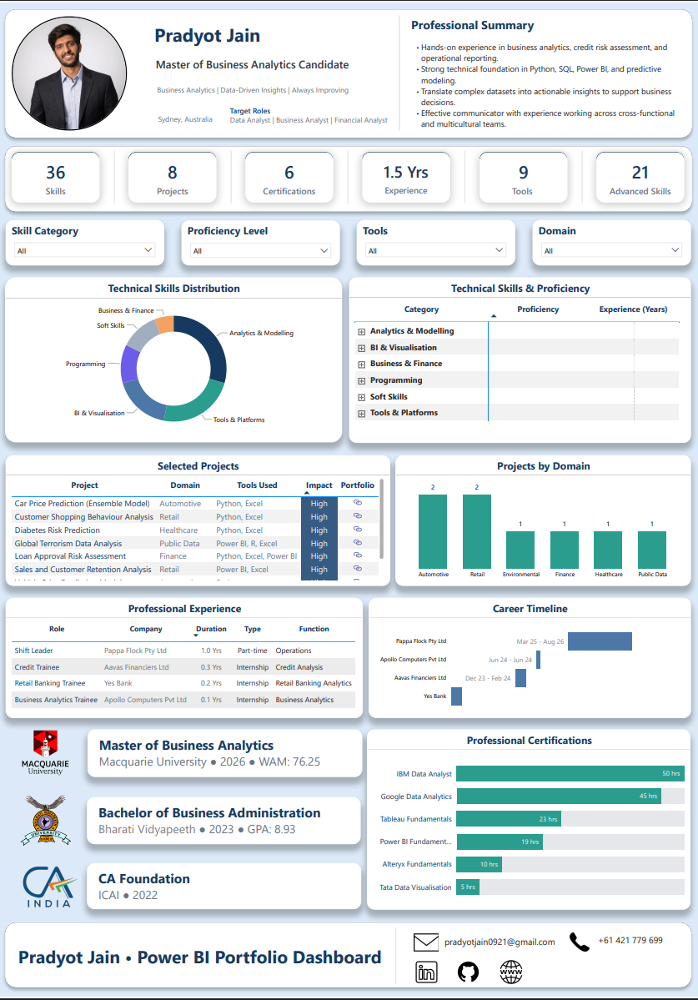

# 📊 Power BI CV Dashboard

An interactive, one-page Power BI dashboard designed as a **modern CV portfolio**, showcasing skills, projects, experience, and certifications in a clean, recruiter-friendly format.

---

## 🔗 Live Interactive Dashboard

👉 [View Dashboard](./Pradyot_Jain_PowerBI_CV_Dashboard.pbix)

---

## 📄 PDF Version

👉 [Download CV Dashboard](./Pradyot_Jain_PowerBI_CV_Dashboard.pdf)

---

## 🖼 Dashboard Preview

---

## 🎯 Project Objective

To design a **visually clean, interactive CV dashboard** that allows recruiters to:

* Quickly assess technical skills
* Explore projects by domain and tools
* Understand experience progression
* Evaluate certifications and learning investment

---

## ⚙️ Key Features

* 🔹 Interactive slicers (Skills, Domain, Tools, Proficiency)
* 🔹 Project filtering with clickable portfolio links
* 🔹 Skill hierarchy with proficiency & experience
* 🔹 Career timeline visualization
* 🔹 Certification analysis based on learning hours
* 🔹 Clean UI with structured visual hierarchy

---

## 🧠 Data Model

* Star schema with bridge tables
* Many-to-many relationships handled via:

  * `tblSkillProjectMap`
  * `Bridge_ProjectTools`
  * `tblSkillCertificationMap`
  * `tblSkillExperienceMap`
  * `tblSkillProjectMap`
  * `tblToolMap`

---

## 📐 Dashboard Sections

1. Profile & Summary
2. KPI Cards
3. Skill Analysis
4. Projects & Domain Insights
5. Professional Experience
6. Career Timeline
7. Education
8. Certifications
9. Interactive Filters

---

## 🛠 Tools & Technologies

* Power BI
* DAX (Calculated columns & measures)
* Data Modeling
* UX/UI Design Principles

---

## 📊 Insights Enabled

* Identify strongest skill areas
* Filter projects by tools & domain
* Analyze certification effort (hours-based)
* Track career progression visually

---

## 📁 Files Included

* `.pbix` → Full Power BI project file
* `.pdf` → Exported CV dashboard
* `/images` → Dashboard previews

---

## 👤 About Me

**Pradyot Jain**
Master of Business Analytics Candidate

📍 Sydney, Australia

---

## 🔗 Connect With Me

* LinkedIn: https://linkedin.com/in/pradyot-jain
* GitHub: https://github.com/pradyot0921
* Email: [pradyotjain0921@gmail.com](mailto:pradyotjain0921@gmail.com)

---

## ⭐ If you found this useful

Feel free to star the repo or connect with me!
