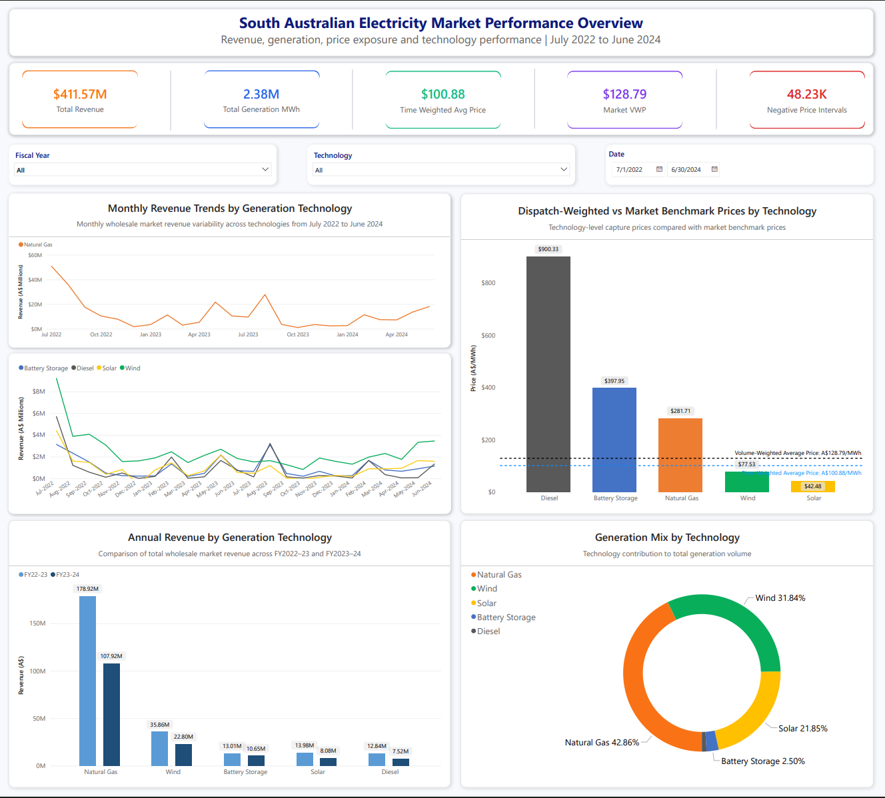
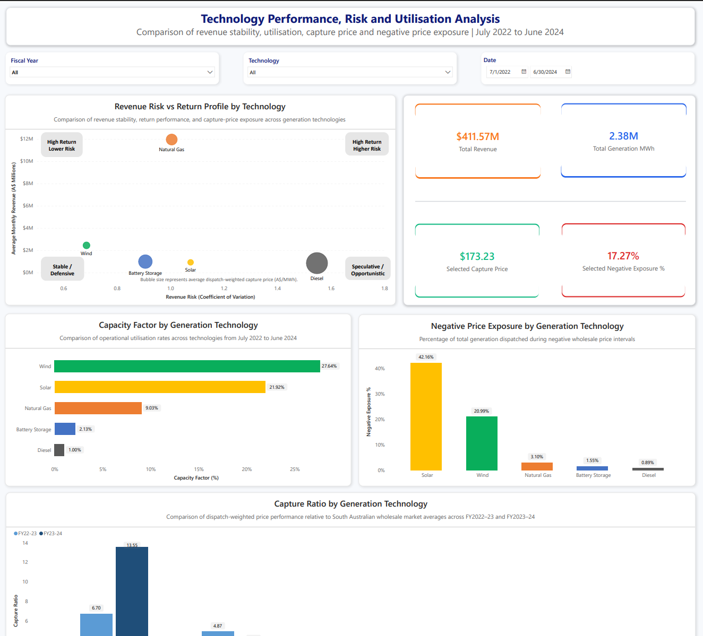
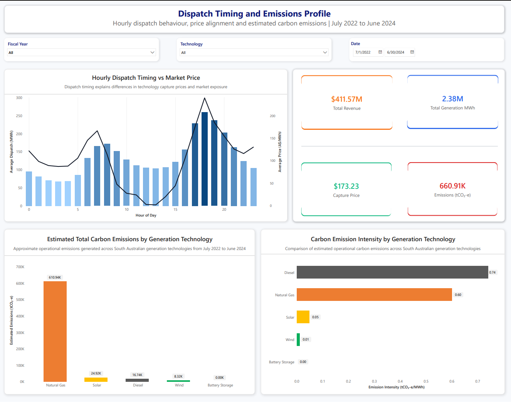
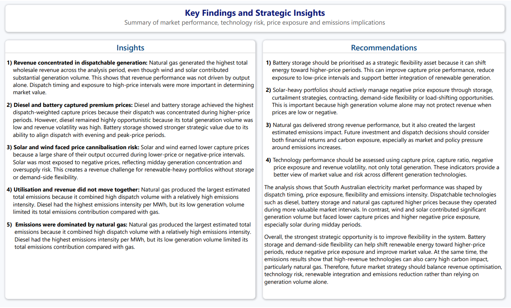

# South Australian Electricity Market Power BI Dashboard

## Project Overview

This project presents an interactive Power BI dashboard analysing South Australian electricity market performance from **July 2022 to June 2024**.

The dashboard evaluates revenue, generation volume, dispatch-weighted capture prices, market benchmark prices, technology-level risk, negative price exposure, dispatch timing and estimated carbon emissions across five generation technologies:

- Natural Gas
- Wind
- Solar
- Battery Storage
- Diesel

The project was developed as a portfolio-style analytics dashboard to demonstrate data preparation, DAX modelling, Power BI dashboard design and business insight communication.

> Note: The dataset is not included in this repository due to academic submission and data-sharing requirements. The repository includes the Power BI dashboard file, final PDF export, preview images and methodology documentation.

---

## Dashboard Preview

### Page 1: Market Overview



### Page 2: Technology Risk



### Page 3: Dispatch and Emissions



### Page 4: Key Findings and Strategic Insights



---

## Dashboard Pages

### 1. Market Overview

The first page provides an executive summary of market performance across the two-year analysis period.

It includes:

- Total revenue
- Total generation
- Time-weighted average price
- Market volume-weighted price
- Negative price intervals
- Dispatch-weighted capture price by technology
- Monthly revenue trends
- Annual revenue by technology
- Generation mix by technology

Key message: **Natural gas dominated total revenue, while wind and solar contributed significant generation volume but earned lower capture prices.**

---

### 2. Technology Risk

The second page compares technology-level performance, utilisation and risk.

It includes:

- Revenue risk vs return profile
- Capacity factor by technology
- Negative price exposure by technology
- Capture ratio by technology
- Selected revenue, generation, capture price and negative exposure KPIs

Key message: **Diesel and battery storage achieved premium capture prices, while solar and wind had higher exposure to lower or negative price periods.**

---

### 3. Dispatch and Emissions

The third page links dispatch behaviour with market price alignment and emissions impact.

It includes:

- Hourly dispatch timing vs market price
- Estimated total carbon emissions by technology
- Carbon emission intensity by technology
- Selected revenue, generation, capture price and emissions KPIs

Key message: **Dispatch timing helps explain price capture differences, while natural gas produced the largest estimated total emissions.**

---

### 4. Key Findings and Strategic Insights

The final page summarises the main insights and recommendations from the dashboard.

It focuses on:

- Revenue concentration in dispatchable generation
- Premium capture prices for diesel and battery storage
- Negative price exposure for solar and wind
- Relationship between utilisation and revenue
- Revenue and emissions trade-offs
- Strategic importance of storage and flexible dispatch

---

## Key Dashboard Metrics

| Metric | Value |
|---|---:|
| Total Revenue | A$411.57M |
| Total Generation | 2.38M MWh |
| Time-Weighted Average Price | A$100.88/MWh |
| Market Volume-Weighted Price | A$128.79/MWh |
| Negative Price Intervals | 48.23K |
| Overall Selected Capture Price | A$173.23/MWh |
| Estimated Total Emissions | 660.91K tCO₂-e |

---

## Key Insights

1. **Revenue was concentrated in dispatchable generation**  
   Natural gas generated the highest total wholesale revenue across the analysis period, even though wind and solar contributed substantial generation volume.

2. **Diesel and battery storage captured premium prices**  
   Diesel and battery storage achieved the highest dispatch-weighted capture prices because their dispatch was concentrated during higher-price periods.

3. **Solar and wind faced price cannibalisation risk**  
   Solar and wind earned lower capture prices because a large share of their output occurred during lower-price or negative-price intervals.

4. **Utilisation and revenue did not move together**  
   Wind and solar showed higher capacity factors, but this did not directly translate into the highest revenue.

5. **Emissions were dominated by natural gas**  
   Natural gas produced the largest estimated total emissions due to high dispatch volume and a relatively high emissions intensity.

---

## Strategic Recommendations

- Prioritise flexible dispatch and battery storage integration to improve price capture.
- Manage renewable negative price exposure through storage, curtailment, contracting and demand-side flexibility.
- Assess technology performance using capture price, capture ratio, negative price exposure and revenue volatility, not only generation volume.
- Balance financial performance with emissions impact when evaluating dispatchable generation.
- Use storage and demand-side flexibility to improve renewable integration and reduce exposure to low-price periods.

---

## Key Measures Used

### Total Revenue

```DAX
Total Revenue =
SUMX(
    tbl_CleanedData,
    (
        tbl_CleanedData[Battery_Total_MWh]
        + tbl_CleanedData[Diesel_Total_MWh]
        + tbl_CleanedData[Gas_Total_MWh]
        + tbl_CleanedData[Solar_Total_MWh]
        + tbl_CleanedData[Wind_Total_MWh]
    )
    * tbl_CleanedData[SA1_Price]
)
```

### Total Generation MWh

```DAX
Total Generation MWh =
SUM(tbl_CleanedData[Battery_Total_MWh])
+ SUM(tbl_CleanedData[Diesel_Total_MWh])
+ SUM(tbl_CleanedData[Gas_Total_MWh])
+ SUM(tbl_CleanedData[Solar_Total_MWh])
+ SUM(tbl_CleanedData[Wind_Total_MWh])
```

### Time-Weighted Average Price

```DAX
Time Weighted Avg Price =
AVERAGE(tbl_CleanedData[SA1_Price])
```

### Market Volume-Weighted Price

```DAX
Market Volume Weighted Price =
DIVIDE(
    SUMX(
        tbl_CleanedData,
        tbl_CleanedData[SA1_Price] * tbl_CleanedData[SA1_Demand]
    ),
    SUM(tbl_CleanedData[SA1_Demand])
)
```

### Technology Capture Price

```DAX
Technology Capture Price =
DIVIDE(
    [Technology Revenue],
    [Technology Generation]
)
```

### Capture Ratio

```DAX
Capture Ratio =
DIVIDE(
    [Technology Capture Price],
    [Time Weighted Avg Price]
)
```

### Selected Negative Exposure %

```DAX
Selected Negative Exposure % =
COALESCE(
    DIVIDE(
        [Selected Negative MWh],
        [Selected Generation MWh]
    ),
    0
)
```

---

## Tools and Skills Demonstrated

- Power BI dashboard development
- DAX measure creation
- Data modelling
- Excel-based data preparation
- Energy market analytics
- Revenue and price analysis
- Risk and volatility analysis
- Negative price exposure analysis
- Emissions estimation
- Executive dashboard design
- Business insight communication

---

## Repository Structure

```text
south-australian-electricity-market-powerbi-dashboard/
│
├── README.md
├── Portfolio.pdf
├── South_Australian_Electricity_Market_Dashboard.pbix
│
├── images/
│   ├── page-1-market-overview.png
│   ├── page-2-technology-risk.png
│   ├── page-3-dispatch-emissions.png
│   └── page-4-insights.png
│
└── documentation/
    └── dashboard-methodology.md
```

---

## Files Included

| File / Folder | Description |
|---|---|
| README.md | Project overview, dashboard preview, insights and technical summary |
| Portfolio.pdf | Final exported dashboard report |
| South_Australian_Electricity_Market_Dashboard.pbix | Power BI dashboard file |
| images/ | Dashboard page preview images |
| documentation/dashboard-methodology.md | Detailed methodology, DAX logic and modelling explanation |

---

## Dataset Availability

The dataset is not included in this repository.

Reason:

- Academic submission requirements
- Data-sharing limitations
- Portfolio repository size and privacy considerations

The methodology file explains the modelling approach, key calculations and dashboard logic used in the project.

---

## How to View the Dashboard

1. Download the `.pbix` file from this repository.
2. Open it using Microsoft Power BI Desktop.
3. Review the four dashboard pages:
   - Market Overview
   - Technology Risk
   - Dispatch and Emissions
   - Key Findings and Strategic Insights

Alternatively, open `Portfolio.pdf` to view the static exported version of the dashboard.

---

## Limitations

- The analysis focuses on selected generators and technologies, not every generator in the South Australian market.
- Emissions are estimated using assumed emissions intensity factors and should be treated as indicative.
- Battery storage emissions were treated as zero direct operational emissions.
- The dataset was structured in wide format, requiring technology-specific DAX measures.
- Results depend on the available interval-level price, demand and dispatch data.

---

## Author

**Pradyot Jain**  
Master of Business Analytics  
Macquarie University

Portfolio: [pradyot-jain.netlify.app](https://pradyot-jain.netlify.app)

---

## Project Status

Completed.
